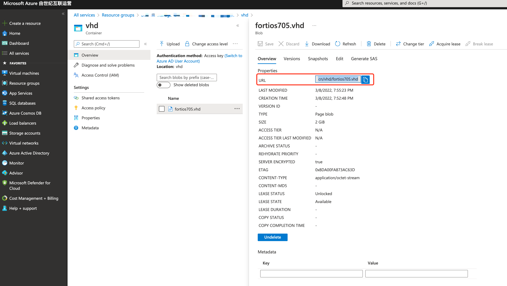

# Deploy FortiGate native HA on Azure China with Terraform

# 背景

为了简化在Azure China上部署FortiGate HA的时间，尝试在Azure China使用Terraform来部署，本文记录在Azure China使用Terraform过程，并指出需要注意的问题

# 部署过程

## 部署脚本

我使用的是Global GitHub上的terraform HA脚本，看了下大致的HA框架都已经有了，只要修改里面的参数，可以在Azure China上工作就可以了，Global GitHub的链接如下

[fortigate-terraform-deploy/azure/7.0/ha-port1-mgmt at main · fortinet/fortigate-terraform-deploy](https://github.com/fortinet/fortigate-terraform-deploy/tree/main/azure/7.0/ha-port1-mgmt)

## 调整环境参数

根据Readme提示，需要修改tfvars文件`terraform.tfvars.example`，删除example的后缀名，填入账号信息，在terraform registry Azure的官方文档上提到，如果要部署在不同的环境需要加上`environment`参数，类似Azure CLI中也需要使用`az cloud set -n AzureChinaCloud`来指定登录的区域，默认为`public`

> environment - (Optional) The Cloud Environment which should be used. Possible values are `public`, `usgovernment`, `german`, and `china`. Defaults to `public`. This can also be sourced from the ARM_ENVIRONMENT Environment Variable.
> 

在`terraform.tfvars`增加environment_id，并在相关的引用`variables.tf`，`provider.tf`中增加`environment`参数，`terraform.tfvars`配置如下

```bash
// Change to your own azure environment
subscription_id                  = "<fill your subscription id>"
client_id                        = "<fill your cient id>"
client_secret                    = "<fill your client secret>"
tenant_id                        = "<fill your tenant id>"
environment                      = "china"
```

详细信息参考Terraform Registry中Azure provider的详细描述

[Terraform Registry](https://registry.terraform.io/providers/hashicorp/azurerm/latest/docs)

## 登录信息

Terraform支持4种登录方式，我选择的是****Authenticating using a Service Principal with a Client Secret这种方式，根据文档操作得到对应的信息填入****`terraform.tfvars`

```bash
$ az account set --subscription="SUBSCRIPTION_ID"
$ az ad sp create-for-rbac --role="Contributor" --scopes="/subscriptions/SUBSCRIPTION_ID"
```

使用上述命令操作后，就能得到`terraform.tfvars`中所需要用到的信息

```bash
{
  "appId": "00000000-0000-0000-0000-000000000000",
  "displayName": "azure-cli-2017-06-05-10-41-15",
  "name": "http://azure-cli-2017-06-05-10-41-15",
  "password": "0000-0000-0000-0000-000000000000",
  "tenant": "00000000-0000-0000-0000-000000000000"
}
```

## 镜像文件

由于中国区不支持Global Maketplace的镜像，在Terraform code中有一段自定义镜像的开关，默认为false，修改为Ture后就可以使用自定义镜像的方式创建虚拟机

在`variables.tf`中将默认值修改为`true`

```bash
// To use custom image 
// by default is false
variable "custom" {
  default = true
}
```

使用自定义镜像方式后，会使用到创建自定义镜像的3个参数，

`customuri`镜像存储的blob地址

`custom_image_name`为镜像命名

`custom_image_resource_group_name`镜像所在的资源组，注意自定义镜像的资源组所在的区域需要与部署的区域相同

```bash
//  Custom image blob uri
variable "customuri" {
  type    = string
  default = "<custom image blob uri>"
}

variable "custom_image_name" {
  type    = string
  default = "<custom image name>"
}

variable "custom_image_resource_group_name" {
  type    = string
  default = "<custom image resource group>"
}
```

在`terraform.tfvars`中增加了`location`,`customuri`,`custom_image_name`,`custom_image_resource_group_name`

```bash
// Change to your own azure environment
subscription_id                  = "<fill your subscription id>"
client_id                        = "<fill your cient id>"
client_secret                    = "<fill your client secret>"
tenant_id                        = "<fill your tenant id>"
environment                      = "china"
location                         = "chinaeast2"
customuri                        = "https://xxx.blob.core.chinacloudapi.cn/vhd/xxx.vhd"
custom_image_name                = "FGT_VM64_AZURE-v7.0.5"
custom_image_resource_group_name = "xxx"
```

上传镜像文件到blob

Azure镜像文件可以通过support网站下载到

[Fortinet Support Potal](https://support.fortinet.com/Download/FirmwareImages.aspx)

以7.0.5为例，文件名如下，解压后就可以获得vhd文件

`FGT_VM64_AZURE-v7.0.5-build0304-FORTINET.out.hyperv.zip`

默认提供的镜像为**Dynamic，需要通过Hyper-V工具转换为Fixed，转换命令如下**

```powershell
PS C:\WINDOWS\system32> Convert-VHD -Path "D:\Azure\fortios705.vhd" -VHDType Fixed
位于命令管道位置 1 的 cmdlet Convert-VHD请为以下参数提供值:DestinationPath: d:\fortios705.vhd
PS C:\WINDOWS\system32>
```

把转换后的vhd文件上传到blob中，复制文件的URL写到`terraform.tfvars`



## 运行Terraform

初始化terraform module

```bash
$ terraform init
```

查看terraform plan是否正常运行

```bash
$ terraform plan
```

确认以后使用apply开始部署

```bash
$ terraform apply
```

整个创建的过程大约需要10分钟左右，运行成功后，可以得到如下的输出

```bash
Outputs:

ActiveMGMTPublicIP = <Active FGT Management Public IP>
ClusterPublicIP = <Cluster Public IP>
PassiveMGMTPublicIP = <Passive FGT Management Public IP>
Password = <FGT Password>
ResourceGroup = <Resource Group>
Username = <FGT admin>
```

# 总结

在Azure上部署FortiGate native HA需要创建相当多的对象，使用Terraform可以大大减少环境搭建的时间，本文中修改后的脚本已经上传至github，修改`terraform.tfvars`就可以使用。

[https://github.com/cmj2010/FortiGate-native-ha-AzureChina](https://github.com/cmj2010/FortiGate-native-ha-AzureChina)